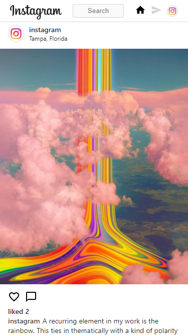
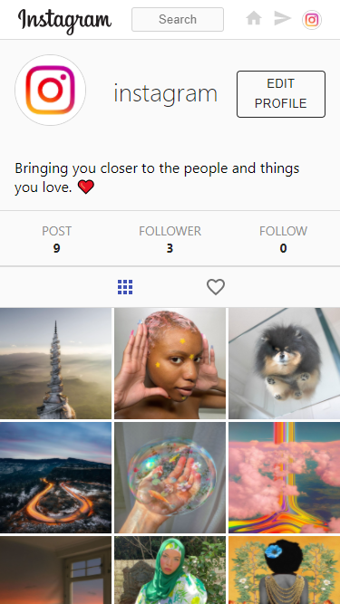

# **Instagram clone** 

This is a clone project of [**Instagram**](https://instagram.com) made with ReactJS.

You can create post, add a comment, follow a user or even send direct message.

Click [**here**](https://instagram-clone-c3621.web.app/) to see the live demo or you can just watch [**video**](https://www.linkedin.com/posts/dh-kim-733227200_reactjs-instagram-linkedin-activity-6759438400706764800-bNwH)

 

## Index

[1. Why did i make](#Why-did-i-make)  
[2. Developement stack](#Developement-stack)  
[3. Detail](#Detail)  
[4. What did i learn](#What-did-i-learn)

 

### **Why did i make**

- To improve reactjs skills
- To get familiar with CRUD operations
- To get familiar with redux

 

### **Developement stack**

 

 
 

### **Detail**

#### **Main page**

- `Shows all user's posts stored in the database (infinite scrolling)`
- `Can like the post, add a comment, click the post for more detail and even follow other users.`
- `Can search all users`

 

#### **Profile page**

- `Can watch all the posts that user has created and posts that user has liked.`
- `Can watch user's followings and follwers`
- `If you are owner of that account, you can edit profile image and introduction`

 

#### **DM page**

- `Can search user and start conversation`

 

#### **Responsive**

- `Fully responsive layout for mobile user`

 

### **What did i learn**

`1. learned importance of organized folder structure, clear variable name.`

As the size of app grows, rewriting code is imperative since i need to fix my code whenever i found a bug.  
 In this kind of moment, organized folder structure and clear variable name make me easily find the file.

`2. learned importance of code refactoring.`

Found out my brain works better when i am watcing clean code.  
 However, when i was trying to write some code on messy code, my brain was fried and don't want to think anymore.  
 Since then, i did code refactoring as much as i can.

`3. learned importance of DB structure.`

As i need to store lots of data like message, user and post, it was really important to have well organized DB strutures so that i can easily read, update or delete it.
